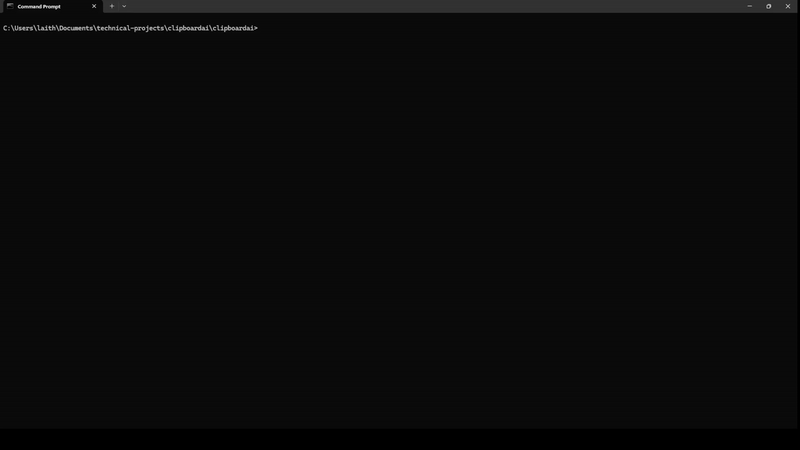

# ClipPilot

A lightweight, cross-platform clipboard monitor that automatically **summarizes anything you copy** using OpenAI chat models.  
Perfect for devs, writers, and researchers who want to stay focused while working with long-form content.

## Quickstart

```bash
# Clone
git clone <repo url>
cd clippilot

# Install
pip install -r requirements.txt

# Configure
cp .env.example .env   # then add your OpenAI API key

# Run
python main.py
```



## Features

- **Real-time monitoring**: auto detects new clipboard content
- **AI-powered summaries**: concise 2-3 bullet takeaways from copied text
- **Resilient**: handles rate limits, timeouts, and network issues
- **Cross-platform**: Works on Windows, macOS, and Linux
- **Minimal**: single script, few dependencies, quick setup


### Example Output

```
Clipboard Monitor Started...
Press Ctrl+C to stop monitoring
========================================
New clipboard content detected:
Length: 1250 characters
Content: [Your copied text here]
========================================
AI Summary:
--------------------
• Key point 1 about the content
• Key point 2 about the content
• Key point 3 about the content
========================================
```

## Dependencies

- **pyperclip**: clipboard access
- **openai**: OpenAI API client
- **python-dotenv**: environment variable management

## Configuration

### Environment Variables

| Variable         | Description         | Required |
| ---------------- | ------------------- | -------- |
| `OPENAI_API_KEY` | Your OpenAI API key | Yes      |


## Troubleshooting

### Common Issues

**"OPENAI_API_KEY not found"**

- Ensure your `.env` file exists and contains the API key
- Check that the key is valid and has sufficient credits

**"Rate limit exceeded"**

- Wait a moment before copying new content
- Consider upgrading your OpenAI plan if needed

**"Request timed out"**

- Check your internet connection
- Try again in a few moments

## Contributing

Contributions welcome! Open an issue or PR.

## License

MIT - feel free to use, modify, and share.
